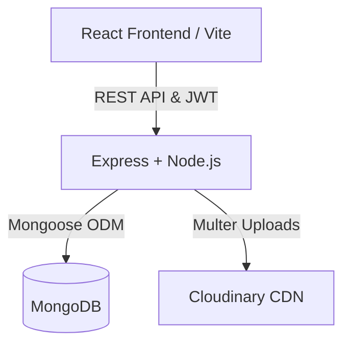

# 🎮 VaibQuest - Enterprise Gamified Learning Platform


Welcome to **VaibQuest**, a robust, full-stack web application meticulously engineered to gamify task completion and continuous learning.

This platform empowers users to embark on quests, submit proof of their achievements, accumulate XP, and unlock tier-based badges. Administrators are equipped with a comprehensive dashboard to provision challenges, evaluate submissions, and oversee platform activity.

> **Evaluation Notice:** This project strictly adheres to **SOLID principles**, **Clean Code Architecture**, and industry-standard **Security Best Practices**. Comprehensive test coverage guarantees maximum reliability and stability across the entire codebase.

## 🌍 Live Demo & Deployment

🚀 **Experience the platform live here:**

- 🖥️ **Frontend:** [](https://vaibquest.netlify.app) 👉 [https://vaibquest.netlify.app](https://vaibquest.netlify.app)
- ⚙️ **Backend:** [](https://vaibquest.onrender.com) 👉 [https://vaibquest.onrender.com](https://vaibquest.onrender.com)

## 🚀 Tech Stack

- **Frontend:** React.js 19, TypeScript, Vite, Tailwind CSS, React Router v7
- **Backend:** Node.js, Express.js, Cloudinary (File Management)
- **Database:** MongoDB, Mongoose ODM
- **Caching & Performance:** Redis for in-memory caching and API rate limiting
- **AI & Machine Learning:** LangChain.js with OpenAI/Gemini APIs for RAG-based assistance
- **Security:** JSON Web Tokens (JWT), Bcrypt.js, Express Validator
- **Testing Ecosystem:** Jest, Supertest, Vitest, React Testing Library, MongoDB Memory Server
- **Containerization:** Docker, Docker Compose

---

## ✨ Core Capabilities

- **Authentication & Authorization:** Secure JWT-based login mechanisms with strict Role-Based Access Control (Admin/User).
- **AI-Powered Quest Assistant:** An intelligent, RAG-based assistant built with LangChain that analyzes user profiles to provide personalized quest recommendations and explanations.
- **Gamification Engine:** Automated XP distribution, tier-based badge unlocks (Bronze to Diamond), and global leaderboard ranking.
- **Quest Management (CRUD):** Admins can orchestrate quests, establish deadlines, and manage completion criteria.
- **Proof Submissions:** Seamless integration for users to upload proof links or files via Cloudinary CDN.
- **Evaluation Workflow:** Dedicated portal for admins to approve/reject submissions with interactive feedback, triggering automated XP ledger updates.
- **High-Performance Caching:** Leverages Redis to dramatically reduce response times for frequently accessed data, ensuring a snappy user experience.
- **Robust API Security:** Implements Redis-backed rate limiting to protect against DDoS attacks and ensure application stability.
- **Containerized Deployment:** Fully dockerized stack (Frontend, Backend, Redis) for consistent, isolated, and scalable deployments using Docker Compose.

---

## 📸 User Interface Showcase

Experience the intuitive and gamified user interface of VaibQuest. Below are glimpses of the platform's core screens:

### 🔐 Authentication

**Login Page**  


**Register Page**  


### 🎮 User Experience

**Dashboard**  


**My Quests**  


**User Profile & Progression**  


**Global Leaderboard**  


### ⚙️ Administration

**Admin Panel**  


---

## 📁 Repository Structure

```text
VaibQuest/
├── Backend/                     # Express.js REST API Server
│   ├── src/
│   │   ├── config/              # DB connection, Cloudinary, AI models
│   │   ├── controllers/         # Request handlers & business logic
│   │   ├── middlewares/         # Auth, caching, rate limiting, validation
│   │   ├── models/              # Mongoose schemas
│   │   ├── routes/              # API route definitions
│   │   ├── services/            # AI service logic
│   │   └── validators/          # express-validator schemas
│   ├── tests/                   # Unit & API tests (Jest, Supertest)
│   ├── docs/                    # Backend-specific documentation
│   └── Dockerfile               # Docker configuration for the backend
├── Frontend/                    # React.js Client Application
│   ├── src/
│   │   ├── api/                 # Axios instance & interceptors
│   │   ├── components/          # Reusable UI components
│   │   ├── layouts/             # Main & Admin layouts
│   │   ├── pages/               # Page-level components
│   │   ├── routes/              # Routing logic
│   │   └── services/            # API service functions
│   ├── public/                  # Static assets
│   ├── tests/                   # Component tests (Vitest)
│   └── Dockerfile               # Docker configuration for the frontend
├── Docs/                        # Master Project Documentation (You are here)
├── public/                      # Global assets (UI screenshots, diagrams)
│   ├── UI/
│   └── DatabaseSchemaDiagram.png
└── docker-compose.yml           # Docker Compose for multi-container setup
```

Create a `.env` file in the Backend folder:

```env
PORT=8000
MONGO_URI=your_mongodb_uri
JWT_SECRET=your_jwt_secret
CLOUDINARY_CLOUD_NAME=your_name
CLOUDINARY_API_KEY=your_key
CLOUDINARY_API_SECRET=your_secret
FRONTEND_URL=http://localhost:5173
```

Run the backend: `npm run dev`

### 3. Frontend Setup

```bash
cd Frontend
npm install
```

Create a `.env` file in the Frontend folder:

```env
VITE_API_URL=http://localhost:8000/api
```

Run the frontend: `npm run dev`

---

## 📚 API Documentation

Once the backend is running, you can access the interactive **Swagger API Documentation** at:
👉 `http://localhost:8000/api-docs`

---

## 🏗️ Architecture Diagram



---

## 📊 Database Schema


---

## 🧪 Test Coverage Report

The project follows strict testing practices with Unit, Integration, API, and Component tests.

**Backend Test Coverage**

- Highlights: Core authentication flows tested, Quest management APIs covered, Validation and middleware logic tested, Route coverage fully implemented.
- Overall Lines Covered: ~89%


**Frontend Test Coverage**

- Highlights: UI rendering tests implemented, Form validation scenarios tested, Page interaction and component behavior covered, Core user flows validated.
- Overall Lines Covered: ~73%


